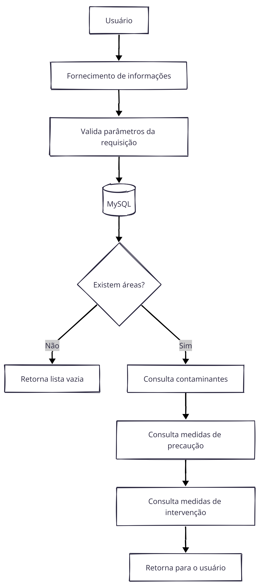
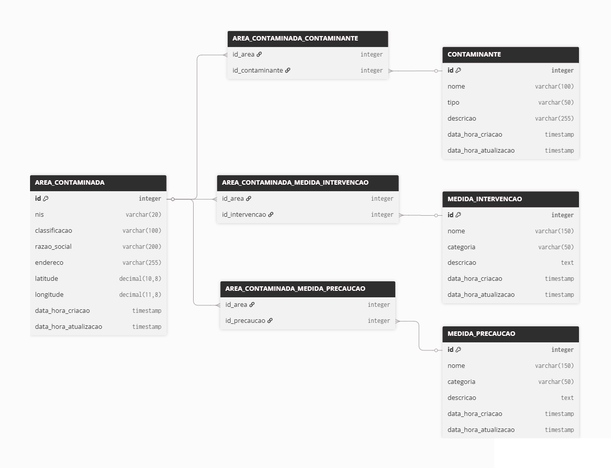

# Microsserviço do Mapa de Cuidados de São Vicente


Microsserviço que, a partir de coordenadas fornecidas pelo usuário, retorna áreas contaminadas próximas com suas informações e as medidas de prevenção que um morador próximo possa realizar. Projeto desenvolvido no contexto da disciplina **ACH3778 - Governo Aberto** da EACH-USP em parceria colaboração com a **Prefeitura de São Vicente** e o **Projeto COOP CLIMA** para ampliar transparência e acesso à informações ambientais da Cidade de São Vicente.

## Visão Geral

O presente microsserviço constitui um dos componentes centrais do projeto **Mapa de Cuidados de São Vicente**, uma iniciativa voltada à democratização do acesso a informações ambientais no município. A ferramenta tem como propósito oferecer à população um meio intuitivo e confiável para consultar áreas contaminadas em sua vizinhança, promovendo assim a transparência e o engajamento cidadão em questões de saúde pública e justiça ambiental.

A API desenvolvida recebe coordenadas geográficas (latitude e longitude) de um ponto de interesse e retorna todas as áreas contaminadas registradas no banco de dados dentro de um raio de até 500 metros. Para cada área identificada, são fornecidas informações estruturadas em três categorias principais:

1. **Dados cadastrais da área**: endereço, classificação oficial conforme sistema SIGAM da CETESB (ACRi, ACRe, AME, AR), razão social do responsável e coordenadas geográficas.

2. **Contaminantes presentes**: relação das substâncias tóxicas identificadas no local, acompanhadas de descrição em linguagem acessível sobre seus potenciais efeitos à saúde humana.

3. **Medidas de precaução e intervenção**: orientações específicas para moradores próximos, incluindo recomendações de autoproteção e informações sobre as ações de remediação em curso pelos órgãos competentes.

## Fluxograma
A API foi desenvolvida utilizando uma arquitetura em camadas, na qual cada componente possui responsabilidades bem definidas. Ao receber uma requisição contendo as coordenadas geográficas (latitude e longitude), a aplicação valida os parâmetros informados e consulta o banco de dados para identificar áreas contaminadas localizadas em um raio de até 500 metros. Caso existam registros, são recuperadas as informações da área, seus contaminantes, as medidas de precaução e as medidas de intervenção associadas. Por fim, todos os dados são consolidados e retornados ao cliente em formato JSON.



## Modelagem Entidade Relacionamento
O banco de dados foi modelado para armazenar informações sobre áreas contaminadas do município e seus respectivos relacionamentos com contaminantes, medidas de precaução e medidas de intervenção. A entidade AREA_CONTAMINADA concentra os dados cadastrais e se relaciona, por meio de tabelas associativas, com as demais entidades, permitindo que uma mesma área possua múltiplos contaminantes e diversas recomendações de prevenção e ações de remediação.




## Configuração do Ambiente

### 1. Clonagem do Repositório

```bash
git clone https://github.com/vitoriabentes/geolocalizacao-precaucao-api.git
cd geolocalizacao-precaucao-api
```

### 2. Configuração do Banco de Dados
Os scripts para criação e população do banco de dados estão disponíveis no diretório: `src/main/resources/database/`. Para a correta instalação da base de dados, os scripts devem ser executados na seguinte ordem:
- `PROJETO_INTEGRADOR_CREATE_TABLES.sql` – criação da estrutura de tabelas do banco de dados 
- `PROJETO_INTEGRADOR_INSERT_CONTAMINANTES.sql` – inserção dos contaminantes cadastrados. 
- `PROJETO_INTEGRADOR_INSERT_MEDIDAS_DE_INTERVENCAO.sql` – inserção das medidas de intervenção realizadas pelos órgãos competentes. 
- `PROJETO_INTEGRADOR_INSERT_MEDIDAS_DE_PRECAUCAO.sql` – inserção das recomendações de precaução à população. 
- `PROJETO_INTEGRADOR_INSERT_AREAES_CONTAMINADAS.sql` – inserção das áreas contaminadas do município. 
- `PROJETO_INTEGRADOR_INSERT_AREAES_CONTAMINADAS_CONTAMINANTES.sql` – relacionamento entre áreas e contaminantes.
- `PROJETO_INTEGRADOR_INSERT_AREAES_CONTAMINADAS_MEDIDAS_INTERVENCAO.sql` – relacionamento entre áreas e medidas de intervenção. 
- `PROJETO_INTEGRADOR_INSERT_AREAES_CONTAMINADAS_MEDIDAS_PRECAUCAO.sql` – relacionamento entre áreas e medidas de precaução.


### 3. Configuração das Credenciais

As credenciais de acesso ao banco de dados são configuradas por meio de variáveis de ambiente, conforme especificado no arquivo `application.properties`. Para configurar o ambiente, crie as variáveis de acordo com o seu sistema operacional.

```properties
spring.datasource.driver-class-name=com.mysql.cj.jdbc.Driver
spring.datasource.url=${DB_URL}
spring.datasource.username=${DB_USERNAME}
spring.datasource.password=${DB_PASSWORD}
```
### 4. Build e Execução
Compile o projeto por meio do Gradle `./gradlew build`. Após a inicialização, a API estará disponível em: `http://localhost:8080`.

### 5. Documentação da API

A documentação completa da API, contendo a descrição detalhada de todos os endpoints, campos de requisição e resposta, e códigos de erro, está disponível em: **Documentação da API:** [`Documentação da API`](docs/)

Para testar a aplicação, consulte o documento de contrato da API, que especifica os formatos de requisição e resposta esperados, bem como exemplos práticos de uso.


